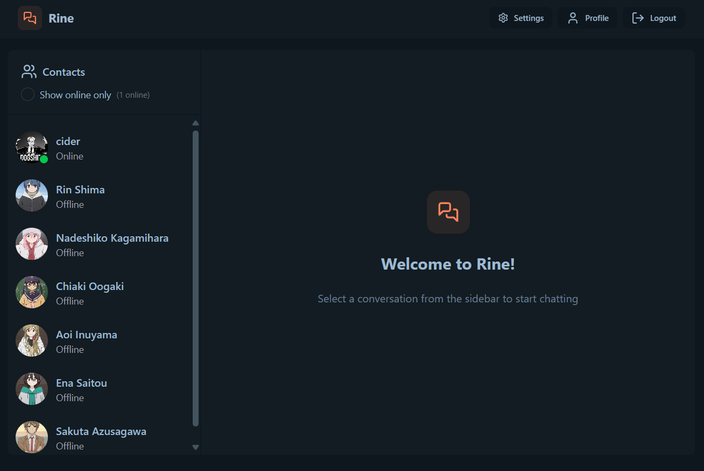
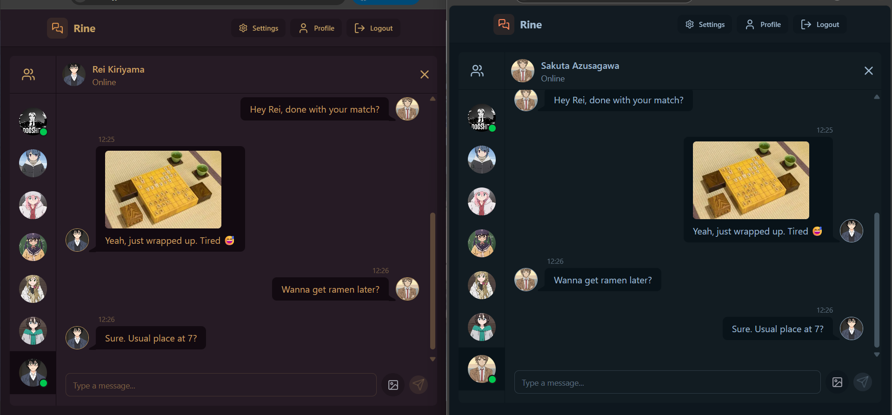
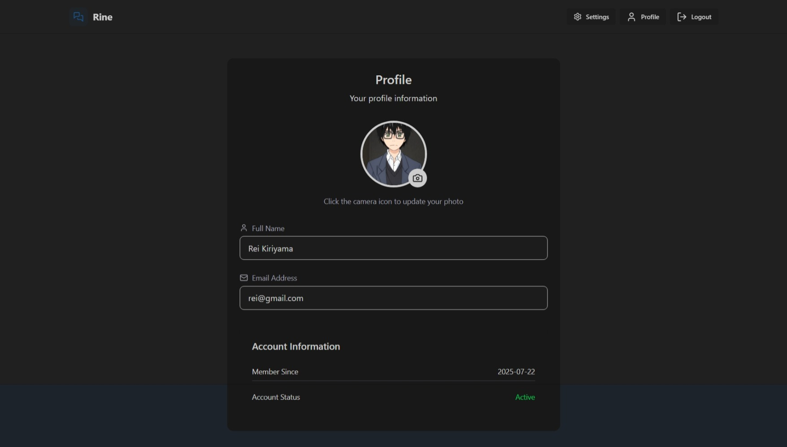

# ✨ Rine — Full‑Stack Realtime Chat App ✨

A full-stack MERN chat application with real-time messaging, image uploads, user auth, and online status tracking.

> *Built with Socket.io, TailwindCSS, Daisy UI, Zustand, Cloudinary, and Vite*

---

## 🖼️ Project Screenshots

> 📸 *Add your screenshots below*

* **Home Page**

  

* **Chat UI**

  

* **Profile Page**

  
---

## 🌟 Key Features

* 🔐 **JWT Auth** – Signup, Login, Protected Routes
* 💬 **Real-time Messaging** – Instant chats using Socket.io
* 🟢 **User Presence** – See who's online
* ☁️ **Cloudinary Uploads** – Media storage with folders
* 📦 **Global State** – Zustand for minimal and efficient state
* 🌐 **Frontend with Vite** – Lightning-fast dev & build
* 🎨 **UI with TailwindCSS + Daisy UI**
* 🛠️ **Error Handling** – Clear messaging on both client/server
* 🚀 **Deployable** – Easily host on Vercel/Render/Netlify/etc.

---

## 📁 Final Folder Structure

```
Rine/
├── backend/
│   ├── controllers/         # Controllers for auth, messages, uploads
│   ├── lib/                 # Utility libs (e.g., socket config)
│   ├── middleware/          # Auth middleware, error handlers
│   ├── models/              # Mongoose models: User, Message, Chat
│   ├── routes/              # Express routes
│   ├── seeds/               # (Optional) Seed scripts for testing
│   ├── index.js             # Entry point with express + socket
│   └── .env.example         # Example env file
│
├── frontend/
│   ├── public/              # Static files
│   ├── src/
│   │   ├── assets/          # Icons, images, style assets
│   │   ├── components/      # Reusable UI (chat box, nav bar, etc.)
│   │   ├── pages/           # Login, Register, ChatRoom
│   │   ├── store/           # Zustand store
│   │   ├── api/             # Axios setup + calls
│   │   ├── hooks/           # Custom React hooks (useAuth, etc.)
│   │   ├── App.jsx          # Main component and router
│   │   └── main.jsx         # ReactDOM entry point
│   ├── index.html
│   ├── vite.config.js
│   ├── tailwind.config.js
│   └── postcss.config.js
│
├── .gitignore
├── README.md
└── package.json
```

---

## 🔧 Setup Guide

### 1. Clone the Repository

```bash
git clone https://github.com/bharathsai369/Rine.git
cd Rine
```

### 2. Set Up Environment Variables

Create a `.env` file in `backend/`:

```env
MONGODB_URI=your_mongo_uri
PORT=5001
JWT_SECRET=your_jwt_secret

CLOUDINARY_CLOUD_NAME=your_cloud_name
CLOUDINARY_API_KEY=your_key
CLOUDINARY_API_SECRET=your_secret

NODE_ENV=development
```

---

## 🚀 Start the App

### Install Dependencies

```bash
cd backend
npm install

cd ../frontend
npm install
```

### Build the Frontend

```bash
npm run build
```

This outputs a `dist/` folder used by the backend to serve the React app.

### Run the Server

```bash
cd ../backend
npm start
```
---

## 📌 Tech Stack

* **Frontend:** React, Vite, TailwindCSS, DaisyUI, Zustand  
* **Backend:** Node.js, Express, MongoDB, Socket.io  
* **Cloud & Tools:** Cloudinary, JWT, Render/Vercel


---

## 📌 Deployment Notes

* Frontend: Deploy `dist/` to Vercel/Netlify
* Backend: Deploy `index.js` on Render or Railway
* Add your `CLOUDINARY` and `MONGODB_URI` secrets to your host

---
